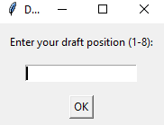
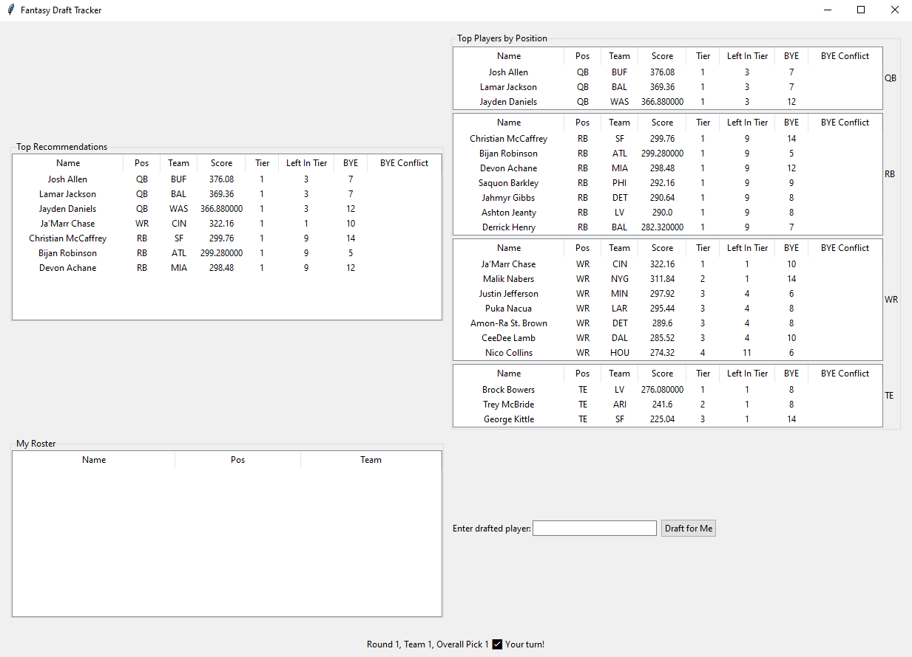

# Fantasy Draft Tool

## Overview

Fantasy Draft Tool is a Python-based application designed to help optimize draft strategy. It provides:
- Automated player tiering based on projections and historical performance
- Real-time draft tracking and recommendations
- Roster management and team composition alerts
- A GUI for easy draft-day use

## CSV Data Files

The tool relies on several CSV files in the `Data/` directory. Each file must follow a specific format:

### 1. `2025_Fantasy_Projections.csv`
**Purpose:** Contains season-long projections for each player.

**Source:** [Razzball](https://football.razzball.com/projections/#google_vignette)

**Required Columns:**
```
NAME, POS, TEAM, PPR_PTS, CMP, ATT, PASS_YDS, PASS_TD, INT, RUSH, RUSH_YDS, RUSH_TD, TGT, REC, REC_YDS, REC_TD
```
**Example:**
```
Josh Allen,QB,BUF,377.7,381,562,4193,28,8.8,133,615,9.8,0,0,0,0
```

### 2. `BYE_WEEKS.csv`
**Purpose:** Lists each NFL team's bye week.

**Source:** Copilot

**Required Columns:**
```
TEAM, BYE
```
**Example:**
```
BUF,7
```

### 3. `PPG_Last3Years.csv`
**Purpose:** Historical PPR points per game for each player over the last three years.

**Source:** [FantasyPros](https://www.fantasypros.com/nfl/reports/leaders/ppr.php?year=2024) 

**Required Columns:**
```
NAME, POS, Y2024, Y2023, Y2022, AVG_PPG_PPR, TEAM
```
**Example:**
```
Josh Allen,QB,21.8,22.7,24.8,23.1,BUF
```

### 4. `Tiered_Player_Data.csv`
**Purpose:** Output file with merged projections, historical data, bye weeks, calculated weighted scores, and assigned tiers.

**Required Columns:**
```
NAME, POS, TEAM, PPR_PTS, CMP, ATT, PASS_YDS, PASS_TD, INT, RUSH, RUSH_YDS, RUSH_TD, TGT, REC, REC_YDS, REC_TD, Y2024, Y2023, Y2022, AVG_PPG_PPR, BYE, WEIGHTED_SCORE, TIER
```

## Configuration Constants

The draft and league format are controlled by constants in `Constants/constants.py`:

> **Disclaimer:** This tool is configured for a 2QB Superflex League format by default.

- `NUM_TEAMS`: Number of teams in the league (default: 8)
- `ROSTER_SIZE`: Number of players per team (default: 17)
- `TOTAL_PICKS`: Total number of picks in the draft (NUM_TEAMS * ROSTER_SIZE)
- `POSITIONS`: List of valid positions (default: ["QB", "RB", "WR", "TE"])
- `roster` (in `Draft_Tracker.py`): Dict specifying max players per position per team:
	- QB: 3
	- RB: 7
	- WR: 7
	- TE: 2

### Player Table Columns (for GUI)
The following columns are used in the GUI and must be present in the data:
- Name, Pos, Team, Score, Tier, Left In Tier, BYE, BYE Conflict

## GUI Breakdown

When running `Draft_Tracker_GUI.py`, the following panels and controls are displayed:


- **Draft Position Prompt:**
	- At startup, a popup prompts you to enter your draft position (1 to number of teams).



**Fantasy Draft Tracker**



- **Top Recommendations Panel (left):**
	- Table labeled "Top Recommendations" showing the top suggested picks for your next draft selection.

- **Top Players by Position Panel (right):**
	- Four tables (QB, RB, WR, TE) each showing the top available players at that position.

- **My Roster Panel (below recommendations):**
	- Table labeled "My Roster" listing all players you have drafted so far.

- **Draft Input and Controls (below position tables):**
	- Entry box to type or search for a player name (with autocomplete dropdown).
	- "Draft for Me" button: Drafts the selected player to your team (only visible on your turn).
	- "Other Team Drafted" button: Marks a player as drafted by another team (only visible when it's not your turn).

- **Draft Progress Info (top):**
	- Displays the current round, your team number, overall pick number, and a "Your turn!" indicator if it is your pick.

- **Other Features:**
	- Clicking a player in any table auto-fills the draft entry box for quick selection.
	- Autocomplete suggestions appear as you type a player name.
	- All tables and recommendations update in real time as picks are made.

The GUI is designed for fast, accurate draft tracking and recommendations, with all information updating live as you make selections.

## Usage

1. Prepare the required CSV files in the `Data/` directory, following the formats above.
2. Run `Player_Tiering.py` to generate tiered player data, outputted into `Tiered_Player_Data.csv`.
3. Use `Draft_Tracker_GUI.py` to launch the draft tracker interface.
4. Follow on-screen prompts to track your draft and get recommendations.

## Notes
- All CSV files must use UTF-8 encoding and have headers as shown above.
- The tool is customizable for different league sizes and roster formats by editing the constants.

---
